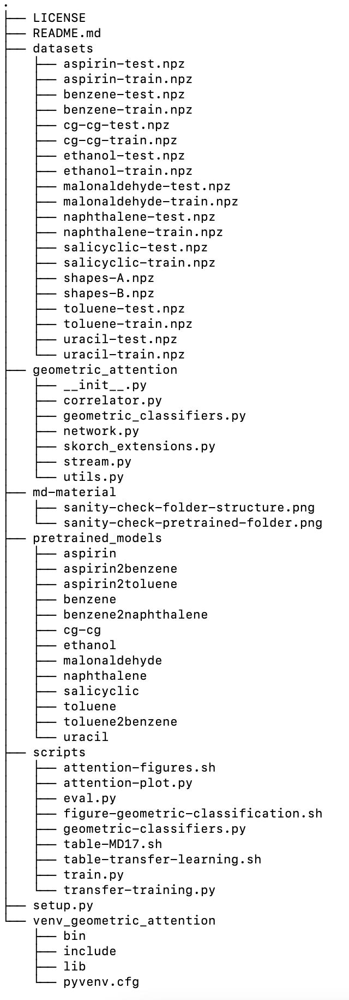
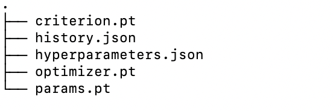

# Detect the Interaction that Matter in Matter: Geometric Attention for Many-Body Systems

## Setup
Clone the code to your local machine using

`git clone https://github.com/thorben-frank/geomatt.git`

Afterwards change into the directory `geomatt`.

### Code

#### Create a Virtual Environment
Lets start by setting up a new virtual environment. Therefore, type

`python3 -m venv venv_geometric_attention`

which will setup a new virtual environment with the name `venv_geometric_attention`. Next activate the 
virtual environment by using the command 

`source venv_geometric_attention/bin/activate`

To install the package geometric attention and all dependencies which are needed in the following run the command

`pip3 install .`
### Getting the Data
In the paper the MD17 data sets and a DNA data set are used. They can be downloaded by clicking [here](http://www.quantum-machine.org/data/geomatt/datasets.zip). 
After unpacking the data please put the folder `datasets` into the `geomatt` folder.
When looking into the datasets folder one sees several .npz files where `<molecule>-train.npz` are the files
that have been used for training and `<molecule>-test.npz` are the files that have been used for testing. The files 
`shapes-A.npz` and `shapes-B.npz` contain training and test data that have been used for the small geometric classification 
experiment in the theory section of the paper.
### Pretrained Models
Pretrained models can be downloaded [here](http://www.quantum-machine.org/data/geomatt/pretrained_models.zip).
After unpacking the data please put the folder `pretrained_models` into the `geomatt` folder.
The folders are named according to the molecule they have been trained on. The folders
`<base_molecule>2<target_molecule>` contain the models that have been retrained in context of the transfer learning task.
### Sanity Check
You should now have a folder structure which looks the following
. 

For readability we restricted the depth of the tree but each directory in the pretrained model
directory should look the following:

This is important such that the shell scripts which are 
intended to ease reproducability can run properly. If you do not intend to use the shell scripts
and plan to save the pretrained models and the data somewhere else you can still run
the models and evaluate the models using the python scripts in the folder `scripts`. 
These scripts give you the possibility to set all paths per hand.

## Get Familiar

### Training a Model
Go into the script folder and run the command

`python3 train.py --help`

It will display explanation on the parameters that can be passed to the model. To train a *GeomAtt* network the general command is

`python3 train.py --train_file <file-path> --save_path <directory>`

The parameter which specifies the path to the training file and a directory where the model should be saved are mandatory. When no further 
parameters are passed to the script it will run with the default parameters which are listed in the table 3 (appendix) in the main paper
in the appendix. For example training a *GeomAtt* network for `N_epochs=50` epochs on benzene with default parameters, correlation orders `k=2` and `k=3` 
and inner product space dimension `Fi = 64` can be achieved by the command

`python3 train.py --train_file ../datasets/benzene-train.npz --save_path ../user_trained_models/geomatt-benzene --orders 2 3 --Fi=64 --N_epochs=50`

When running the training script from above the directory `../user_trained_models/geomatt-benzene` is created from where the script is run. 
For the purpose of illustration relative paths are used here but we strongly recommend to use absolute paths instead, as they
are often a source of error. It contains several files which record the training and validation history, the model
hyperparameters and the network parameters with the lowest validation error. 

### Evaluate a Model
Type 

`python3 eval.py --help`

for full details on parameters that can be passed to the evaluation script. 
To validate a trained model on the test data use the command

`python3 eval.py --model_path <directory> --evaluation_file <file-path> --train_file <file-path>`

The parameter `--model_path` specifies the location where the model has been saved and the `--evaluation_file` sets the location of the 
evaluation file. Additionally, one has to pass the file on which the model has been trained to `--train_file` in order to scale the output of the network
properly. We can use this to evaluate our trained model from above on `N_eval = 100` test points

`python3 eval.py --model_path ../user_trained_models/geomatt-benzene --evaluation_file ../datasets/benzene-test.npz --train_file ../datasets/benzene-train.npz --N_eval=100`
 
When passing no argument for `N_eval = 100` all test points are used for evaluation. As this are up to 1M per molecule, 
the parameter `N_eval` can be used if one is interested in a rough estimate for the model performance. The script 
outputs the mean absolute error (MAE) for energy and forces.

### Transfer Learning
Type 

`python3 transfer-training.py --help`

for full details on parameters that can be passed to the transfer learning script. The transfer learning script handles 
two things for you. If one runs the command

`python3 transfer-training.py --train_file <file-path> --pretrained_path <directory> --save_path <directory>`

the `transfer-training.py` script does the following things for you: It loads a pretrained model that has been trained 
on some base molecule from `--pretrained_path`. It freezes all parameters apart from the last layer and retrains only 
the free parameters to match the training data of the target molecule which must be specified by `--train_file`. The 
transferred model is then saved to `--save_path`.

If we want to transfer for example our trained benzene model to naphthalene we can do this by using the command

`python3 transfer-training.py --train_file ../datasets/naphthalene-train.npz --pretrained_path ../user_trained_models/geomatt-benzene --save_path ../user_transferred_models/benzene2naphthalene --N_epochs=50`  

In order to avoid confusion with the evaluation script we want to remark that the `--train_file` flag from above 
corresponds to the file which is used to retrain the final layers.

We can now evaluate the transferred model by using again the evaluation script in the fashion from before but with 
adjusted paths

`python3 eval.py --model_path ../user_transferred_models/benzene2naphthalene --evaluation_file ../datasets/naphthalene-test.npz --train_file ../datasets/naphthalene-train.npz --N_eval=100`
## Results
Here we recap the performance results of *GeomAtt* on the MD17 benchmark and on the transfer learning task. 

|        | Aspirin | Benzene | Ethanol | Malonaldehyde | Naphthalene | Salicyclic | Toluene | Uracil |
|--------|---------|---------|---------|:-------------:|-------------|------------|---------|--------|
| Energy | 0.89    | 0.18    | 0.25    | 0.32          | 0.32        | 0.35       | 0.24    | 0.27   |
| Forces | 2.03    | 0.41    | 0.98    | 1.31          | 0.81        | 1.17       | 0.80    | 0.99   |

The results on the transfer learning were the following

|        | Aspirin2Benzene | Aspirin2Toluene | Benezene2Naphthalene | Toluene2Benzene |
|--------|-----------------|-----------------|----------------------|:---------------:|
| Energy | 0.38            | 0.80            | 1.16                 | 0.21            |
| Forces | 1.45            | 2.36            | 3.97                 | 0.83            |

The results of both tables can be reproduced by using either the python scripts or the shell script as described in 
detail in the sections below.

## Reproduce the Paper Results using Pretrained Models
After we have seen the general syntax for the python scripts we now proceed to give a guide on reproducing the results 
from the paper. For that two options are possible:

1) Use the python scripts to evaluate results individually. This corresponds to reproducing step by step each 
entry in the tables and each figure.
2) We additionally provide shell scripts which are intended to ease the use and call the python scripts for you.

### Using the Python Scripts
#### MD17
As we have seen before a model can be evaluated using the `eval.py` script. For a given `<molecule-name>` this corresponds to
run the command 

`python3 eval.py --model_path ../pretrained_models/<molecule-name> --evaluation_file ../datasets/<molecule-name>-test.npz --train_file ../datasets/<molecule-name>-train.npz`

E.g. for aspirin one should run

`python3 eval.py --model_path ../pretrained_models/aspirin --evaluation_file ../datasets/aspirin-test.npz --train_file ../datasets/aspirin-train.npz --N_eval=250`

which evaluates the aspirin model on 250 test points. In order to get the exact same values as in the table reported in the 
paper and below just remove the `--N_eval` flag. Other molecules work similar.

#### Transfer Learning
The entries in the transfer learning table can be reproduced in a similar fashion where we just reset the paths. In general
the command for this looks the following

`python3 eval.py --model_path ../pretrained_models/<base-molecule>2<target-molecule> --evaluation_file ../datasets/<target-molecule>-test.npz --train_file ../datasets/<target-molecule>-train.npz`

The placeholder `<base_molecule>` describes the molecule on which the network has been originally trained and 
`<target-molecule>` is a placeholder for the molecule to which the base molecule network has been transferred.

E.g. for aspirin to benzene one should run

`python3 eval.py --model_path ../pretrained_models/aspirin2benzene --evaluation_file ../datasets/benzene-test.npz --train_file ../datasets/benzene-train.npz --N_eval=250`

which evaluates the model for aspirin transfered to benzene on 250 test points. In order to get the exact same values as in the table reported in the 
paper and below just remove the `--N_eval` flag. Other molecules work similar.

#### Attention Matrix Plots
The plots for the attention matrices can be generated by using the script `attention-plot.py` for which details can be 
displayed by typing

`python3 attention-plot.py --help`

The general command to create a figure is then given as 

`python3 attention-plot.py --model_path <directory> --evaluation_file <file-path> --figure_folder <directory> --L=<int> --k=<int> --i=<int> --N_eval=<int>`

The flags `--L` `--k` and `--i ` determine the layer number, the order of the stream and the test point index 
which is used the generate the attention matrix plot. Note that there is an additional flag `--N_eval` which determines 
the total number of evaluation points used (defaults to 10). Thus, `--i` must not be larger than `--N_eval`. The flag 
`--figure_folder <directory>` determines the directory where the figure is saved.

For figure 5 upper part run

`python3 attention-plot.py --model_path ../pretrained_models/aspirin --evaluation_file ../datasets/aspirin-test.npz --figure_folder ../figures/figure5_upper --L=1 --k=2 --i=1 --N_eval=1`

and for the lower part

`python3 attention-plot.py --model_path ../pretrained_models/aspirin2benzene --evaluation_file ../datasets/benzene-test.npz --figure_folder ../figures/figure5_lower --L=1 --k=2 --i=1 --N_eval=1`

For figure 6.b run 

`python3 attention-plot.py --model_path ../pretrained_models/cg-cg --evaluation_file ../datasets/cg-cg-test.npz --figure_folder ../figures/figure_6b --L=1 --k=2 --i=1 --N_eval=1`

and for figure 6.c run

`python3 attention-plot.py --model_path ../pretrained_models/cg-cg --evaluation_file ../datasets/cg-cg-test.npz --figure_folder ../figures/figure_6c --L=2 --k=2 --i=1 --N_eval=1`

### Using the Shell Scripts
Executing the commands all by hand is tedious which is why we provide shell scripts to ease the usage. **A word of 
warning:** These shell scripts only work if they are executed from **within the script folder** and the dateset and 
pretrained model folder have been saved as described in the setup. 

#### MD17
The results for the table which displays performance on the MD17 benchmark can be obtained by executing the shell
script `table-MD17.sh` from **within the script folder**

`source ./table-MD17.sh 100`

where the 100 in the end sets the number of evaluation points `N_eval` which is passed to the python scripts.
Removing the 100 in the script above, all test points (instead fo 100) for each molecule are used such that the 
script displays the exact values from the table in the shell.

#### Transfer Learning
The results for the table which displays the performance on the transfer learning can be obtained by executing the shell
script `table-transfer-learning.sh` from **within the script folder**

`source ./table-transfer-learning.sh 100`

where the 100 in the end again sets the number of evaluation points `N_eval` which is passed to the python scripts.
Removing the 100 in the script above, all test points (instead fo 100) for each molecule are used such that the 
script displays the exact values from the table in the shell.

#### Attention Matrix Figures
The shell script `attention-figures.sh` generates the attention matrices used in the figures of the paper.
Run

`source ./attention-figures.sh`

from **within the script folder** which saves the figures into `geomatt/figures`.

## Reproduce the Paper Results in and End2End Fashion
So far, we have only shown how to observe the paper results using the pretrained models. The same can be done
in an end to end fashion where the user first trains the model and uses this model for evaluation and plotting.
This can be easily achieved with the python scripts already describes. 

Start by training the model using the default parameters which just corresponds to not passing any addtional 
flags to the `train.py` script

`python3 train.py --train_file <file-path> --save_path <directory>`

If we want to transfer our learned model to a different molecule we use the `transfer-learning.py`

`python3 transfer-training.py --train_file <file-path> --pretrained_path <directory> --save_path <directory>`

The models can be evaluated and attention matrices plotted using the already described scripts `eval.py` and 
`attention-plot.py`. 

## Geometric Classification
So far we have focussed on reproducing the main results from the paper. We now give instructions on how to 
reproduce the figures from the **Geometric Classification** section in the paper. As the training is cheap we do not 
provide pretrained models. 

Typing

`python3 geometric-classifiers.py --help`

displays the parameters that can be passed to the script. In the paper we have to cases:

A) Two shapes can only be distinguished by the angles.

B) Two shapes can only be distinguished by the dihedral angles.

Each of these cases has a separate file in the `datasets` folder. 

The general usage of the `geometric-classifiers.py` is the following

`python3 geometric-classifiers.py --train_file <file-path> --figure_folder <directory>` 

which will perform classification of the shapes stored in `--train_file` with a standard message passing step and plots
the final embeddings into the `--figure_folder` directory. Running the command

`python3 geometric-classifiers.py --train_file ../datasets/shapes-A.npz --figure_folder ../figures/shapes-A --N_epochs=75`

will perform a geometric classification using the standard aggregation step on the shapes A1 and 
A2 for 75 epochs. As it can be seen on the resulting accuracy as well as on the figure 
which lies in the directory `../figures/shapes-A` a standard MP step fails to distinguish the shapes. The usage of the 
geometric attention operation can be set by appropriately setting the `--mode` where the order is specified by the 
`--order` flag. Running the command 

`python3 geometric-classifiers.py --train_file ../datasets/shapes-A.npz --figure_folder ../figures/shapes-A --mode geomatt --order=3 --N_epochs=75`

will show that the geometric attention operator of order k=3 can distinguish the shapes. This can be seen on the plot
as well as on the achieved accuracy on the test set which is plotted in the end.

As before one can also run a shell script `figure-goeometric-classification.sh` from **within the script directory** by
running the command

`source ./figure-geometric-classification.sh`

This scripts successively trains the models, outputs the achieved accuracies and saves the 
embedding plots into the directories `geomatt/figures/shapes-A` and `geomatt/figures/shapes-B`, 
respectively.

